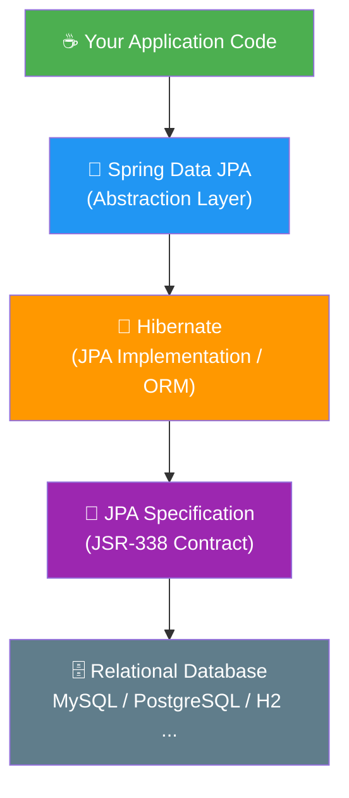

# 📘 JPA vs Hibernate vs Spring Data JPA

---

## 🎯 Objective

Understand the roles and responsibilities of **Java Persistence API (JPA)**, **Hibernate**, and **Spring Data JPA** — how they differ from each other, how they relate to one another, and when to use each in real-world Spring Boot applications.

---

## 📖 Introduction

Persistence — the ability to save application data beyond the life of a running program — is fundamental to almost every enterprise application. In the Java ecosystem, three closely related technologies handle this concern: **JPA**, **Hibernate**, and **Spring Data JPA**. Developers new to Java often confuse these three, partly because they are deeply interconnected, and partly because the terms are sometimes used interchangeably in the community.

This README unpacks each technology, clarifies the boundaries between them, and demonstrates through code how each one approaches the same task of saving an `Employee` record to a database.

---

## 🧩 What is JPA?

**Java Persistence API (JPA)** is a standard Java specification (JSR 338) that defines a common way to map Java objects to relational database tables and to manage their lifecycle. Think of JPA as a **contract** or **rulebook** — it defines the annotations (`@Entity`, `@Table`, `@Id`), the `EntityManager` interface, JPQL (Java Persistence Query Language), and the transaction model that all JPA-compliant frameworks must follow.

> ⚠️ **Important:** JPA is a *specification only* — it ships no working code that can connect to a database by itself. You always need a concrete **JPA provider** (implementation) at runtime.

Key JPA concepts:

| Concept | Description |
|---|---|
| `@Entity` | Marks a Java class as a persistent entity |
| `@Table` | Maps the entity to a specific database table |
| `@Id` | Marks the primary key field |
| `EntityManager` | Central API for CRUD operations |
| JPQL | Object-oriented query language, similar to SQL |
| `persistence.xml` | Configuration file describing the persistence unit |

---

## 🐘 What is Hibernate?

**Hibernate** is a mature, open-source **Object-Relational Mapping (ORM) framework** that provides a full implementation of the JPA specification. Where JPA defines *what* persistence should look like, Hibernate defines *how* it actually works under the hood — generating SQL, managing connections, and handling the database dialect.

Beyond standard JPA compliance, Hibernate also ships several powerful proprietary features:

- **HQL (Hibernate Query Language)** — a superset of JPQL
- **First-level & second-level caching** — reduces redundant database round-trips
- **Lazy loading** — defers fetching associated objects until they are actually accessed
- **Automatic schema generation** — can create or update database tables from entity classes
- **Native SQL support** — for queries that JPQL cannot express

Other JPA providers exist (EclipseLink, OpenJPA), but Hibernate is by far the most widely adopted in production Spring Boot applications.

---

## 🌱 What is Spring Data JPA?

**Spring Data JPA** is part of the broader **Spring Data** project. It is *not* a JPA provider and does *not* implement the JPA specification itself. Instead, it adds an additional abstraction layer **on top of** a JPA provider like Hibernate, with the goal of dramatically reducing the boilerplate code developers need to write for data access layers.

Its core feature is the **Repository pattern** — by extending interfaces such as `JpaRepository`, developers get common CRUD operations, pagination, and sorting out of the box, without writing a single line of SQL or JPQL.

Spring Data JPA also supports:

- **Query derivation from method names** — e.g., `findByLastNameAndEmail()` generates the query automatically
- **`@Query` annotation** — for custom JPQL or native SQL when method names are not expressive enough
- **Declarative transactions** — via `@Transactional` without manual session or connection management
- **Pagination and sorting** — built into repository interfaces

---

## 🔗 Relationship Between JPA, Hibernate, and Spring Data JPA

The three technologies sit in a clear **layered hierarchy**:



In plain English:
- **JPA** defines the rules.
- **Hibernate** follows those rules and does the actual database work.
- **Spring Data JPA** makes it even easier to talk to Hibernate by hiding repetitive repository code.

---

## 📊 Feature Comparison Table

| Feature | JPA | Hibernate | Spring Data JPA |
|---|:---:|:---:|:---:|
| Type | Specification | ORM Framework | Abstraction Library |
| Implements JPA? | N/A (defines it) | ✅ Yes | ❌ No |
| Standalone usable? | ❌ No | ✅ Yes | ❌ Needs JPA provider |
| Boilerplate reduction | ➖ Moderate | ➖ Moderate | ✅ High |
| Caching support | ❌ (optional via provider) | ✅ L1 & L2 cache | ✅ (via Hibernate) |
| Lazy loading | ✅ (spec) | ✅ (implemented) | ✅ (via Hibernate) |
| Custom query language | JPQL | HQL + JPQL | JPQL + method names |
| Declarative transactions | ✅ | ✅ | ✅ `@Transactional` |
| Auto repository generation | ❌ | ❌ | ✅ `JpaRepository` |
| Pagination & sorting | ❌ | ❌ | ✅ Built-in |

---

## 💻 Code Examples Explained

### 🐘 Example 1 — Pure Hibernate Session API

```java
public Integer addEmployee(Employee employee) {
    Session session = factory.openSession();
    Transaction tx = null;
    Integer employeeID = null;
    try {
        tx = session.beginTransaction();
        employeeID = (Integer) session.save(employee);
        tx.commit();
    } catch (HibernateException e) {
        if (tx != null) tx.rollback();
        e.printStackTrace();
    } finally {
        session.close();
    }
    return employeeID;
}
```

**What's happening here:**

| Step | Code | Purpose |
|---|---|---|
| 1 | `factory.openSession()` | Opens a Hibernate `Session` (unit of work with the DB) |
| 2 | `session.beginTransaction()` | Starts a database transaction explicitly |
| 3 | `session.save(employee)` | Inserts the `Employee` object; Hibernate generates the INSERT SQL |
| 4 | `tx.commit()` | Commits the transaction — changes are persisted |
| 5 | `tx.rollback()` | If any exception occurs, all changes are undone |
| 6 | `session.close()` | Always executed via `finally` to free the connection |

**Observation:** Even this simple insert requires ~15 lines of session and transaction plumbing. Imagine doing this across dozens of entities in a large application.

---

### 🌱 Example 2 — Spring Data JPA Repository Pattern

**`EmployeeRepository.java`**

```java
public interface EmployeeRepository extends JpaRepository<Employee, Integer> {
}
```

**`EmployeeService.java`**

```java
@Autowired
private EmployeeRepository employeeRepository;

@Transactional
public void addEmployee(Employee employee) {
    employeeRepository.save(employee);
}
```

**What's happening here:**

- `JpaRepository<Employee, Integer>` — Spring Data JPA generates a full working implementation of this interface at startup. The two generic parameters specify the entity type (`Employee`) and the primary key type (`Integer`).
- The interface body is **empty** — yet it already provides `save()`, `findById()`, `findAll()`, `deleteById()`, `count()`, and more.
- `@Transactional` — Spring manages the transaction boundaries automatically; no manual `beginTransaction()` or `rollback()` is needed.
- `employeeRepository.save(employee)` — delegates down to Hibernate, which ultimately generates and executes the same INSERT SQL as Example 1.

**The same database operation, but with a fraction of the code.**

---

## ✅❌ Advantages and Disadvantages

### JPA
| ✅ Advantages | ❌ Disadvantages |
|---|---|
| Vendor-neutral standard | No standalone implementation |
| Promotes portability across ORM providers | Limited to what the spec defines |
| Widely adopted and well-documented | Requires a provider for everything |

### Hibernate
| ✅ Advantages | ❌ Disadvantages |
|---|---|
| Full-featured ORM — caching, lazy loading, HQL | Steeper learning curve |
| Fine-grained control over sessions and queries | More boilerplate for basic operations |
| Excellent performance tuning capabilities | Misconfiguration can cause N+1 query issues |

### Spring Data JPA
| ✅ Advantages | ❌ Disadvantages |
|---|---|
| Minimal boilerplate — just define an interface | Abstraction can hide performance problems |
| Rapid development of CRUD repositories | Less control than raw Hibernate sessions |
| Seamless Spring ecosystem integration | Requires understanding of underlying JPA/Hibernate |

---

## 🏆 Best Practices

- **Understand the layers.** Before using Spring Data JPA, learn JPA annotations and Hibernate behaviour — the abstraction leaks in complex scenarios.
- **Use `@Transactional` at the service layer**, not the repository layer, to keep transaction boundaries meaningful.
- **Avoid the N+1 query problem** by using `@EntityGraph` or `JOIN FETCH` in JPQL when loading associations.
- **Enable SQL logging in development** (`spring.jpa.show-sql=true`) to verify what Hibernate is actually sending to the database.
- **Prefer `Optional<T>` return types** from repository methods to avoid `NullPointerException` surprises.
- **Use DTOs or projections** instead of returning full entity objects in API responses to avoid over-fetching.

---

## 🏗️ Real-World Analogy

Think of building a house:

| Technology | Analogy |
|---|---|
| **JPA** | The building code and architectural standards — the rules every builder must follow |
| **Hibernate** | The construction crew — they read the blueprints and actually lay the bricks |
| **Spring Data JPA** | A smart project manager — coordinates the crew, handles scheduling, and saves you from micro-managing every nail |

You still live in the same house at the end. But how much effort you spent building it depends on which layer you engaged with.

---

## 🔑 Key Takeaways

1. **JPA** is a *specification* (JSR 338) — it defines the contract but does no real work on its own.
2. **Hibernate** is a *JPA implementation* — it provides the actual ORM engine, plus extra features beyond the spec.
3. **Spring Data JPA** is *not a JPA implementation* — it is an abstraction layer over Hibernate (or any JPA provider) that eliminates boilerplate repository code.
4. In a typical Spring Boot app, all three are present simultaneously — Spring Data JPA calls Hibernate, which follows the JPA specification.
5. Choosing the right level of abstraction depends on your need for control vs. development speed.

---

## 🏁 Conclusion

JPA, Hibernate, and Spring Data JPA each occupy a distinct and complementary role in the Java persistence stack. JPA ensures your code is portable and standards-compliant. Hibernate does the heavy lifting of translating Java objects into relational database operations. Spring Data JPA makes the whole experience dramatically more productive by generating repository implementations automatically.

For most modern Spring Boot applications, Spring Data JPA backed by Hibernate is the recommended approach — it balances productivity with the power to drop down to raw Hibernate or JPQL whenever a situation demands it.
